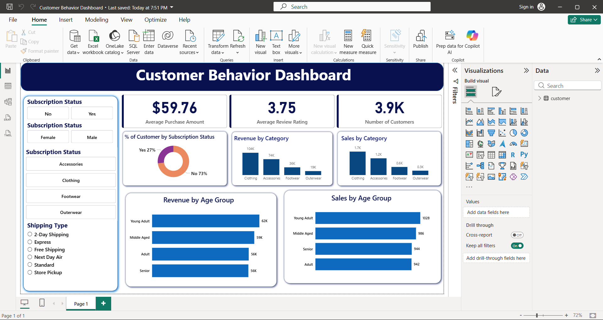

# Customer-Trends-Data-Analysis-SQL-Python-PowerBI
A consumer behavior analytics project using Python, SQL, and Power BI to explore shopping trends, customer segments, loyalty drivers, and purchase patterns. Features data cleaning, modeling, SQL queries, interactive dashboards, and a detailed report to support smarter marketing, engagement, and product decisions.

# 🛒 Retail Consumer Behavior Analysis

## 📖 Overview
This end-to-end data analytics project addresses a critical business need for a leading retail company: understanding customer shopping behavior to drive sales, improve satisfaction, and foster loyalty. By analyzing transactional data, we uncover the key factors—such as discounts, product reviews, and seasonal trends—that influence purchasing decisions. The final deliverables provide actionable insights to optimize marketing and product strategies.

## 🎯 Business Problem
The management seeks to answer the overarching question:

**"How can the company leverage consumer shopping data to identify trends, improve customer engagement, and optimize marketing and product strategies?"**

## 📁 Dataset
The analysis uses a consumer behavior dataset containing information on:

- **Customer Demographics**: Age, gender, location
- **Transactions**: Product details, purchase amount, date
- **Sales Channel**: Online vs. in-store purchases
- **Customer Sentiment**: Product reviews and ratings
- **Promotional Data**: Discounts, payment methods

*(Note: The specific source and file name of the dataset should be placed here, e.g., retail_consumer_data.csv)*

## 🛠️ Tools & Technologies
| Stage | Tools |
|-------|-------|
| Data Cleaning & EDA | Python (Pandas, NumPy, Matplotlib, Seaborn) |
| Database & Analysis | PostgreSQL (Compatible with MySQL/SQL Server) |
| Visualization | Microsoft Power BI |
| Reporting | Microsoft Word / Google Docs |
| Presentation | Gamma App |
| Version Control | GitHub |

## 🚀 Project Steps & Deliverables

### 1. Data Preparation & Modeling (Python)
**`data_cleaning.py`**: Load the raw dataset and perform initial Exploratory Data Analysis (EDA).

**Activities**: Handle missing values, remove duplicates, correct data formats, and engineer new features (e.g., `purchase_season`, `customer_segment`).

**Output**: A clean, analysis-ready dataset.

### 2. Data Analysis (SQL)
**`sql_queries.sql`**: Organize the clean data into a structured database schema and run analytical queries.

**Sample Query Insights**:
- Identify top-spending customers and high-value segments.
- Analyze the impact of discounts on purchase frequency and volume.
- Compare sales performance and product preferences across online vs. offline channels.
- Uncover seasonal purchasing trends.

**Output**: A set of SQL queries answering specific business questions.

### 3. Visualization & Dashboard (Power BI)
**`retail_consumer_analysis.pbix`**: An interactive Power BI dashboard built for stakeholder decision-making.

**Key Dashboard Pages**:



- **Executive Summary**: High-level KPIs (Total Revenue, Customer Count, Repeat Purchase Rate).
- **Customer Segmentation**: Analysis by demographics and value.
- **Sales Channel Performance**: Online vs. In-store comparison.
- **Product & Promotion Analysis**: Impact of discounts and top-reviewed products.

### 4. Report and Presentation
- **`Project_Report.pdf`**: A comprehensive document summarizing the methodology, key findings, and strategic business recommendations.
- **`Stakeholder_Presentation.gamma`**: A visually engaging Gamma presentation designed to communicate insights and actionable recommendations effectively to a non-technical audience.

## 📊 Results & Key Insights
- **Customer Loyalty Drivers**: Identified that customers who leave a product review are X% more likely to make a repeat purchase.
- **Promotional Effectiveness**: Discovered that discounts above 15% primarily attract one-time buyers, while smaller, targeted discounts improve long-term customer value.
- **Channel Preference**: Found a significant demographic split between online and in-store shoppers, indicating a need for channel-specific marketing campaigns.
- **Seasonal Trends**: Pinpointed Q4 as the critical period for launching new products and loyalty programs.

*(These are example insights. Your analysis will populate this section with concrete findings.)*

## ▶️ How to Run This Project

### Prerequisites
- Python 3.8+ with libraries: pandas, numpy, matplotlib, seaborn
- A running instance of PostgreSQL, MySQL, or SQL Server
- Power BI Desktop (to view the dashboard)
- Gamma account (to view the presentation)

### Step-by-Step Execution

1. **Clone the Repository**
   ```bash
   git clone https://github.com/your-username/retail-consumer-analysis.git
   cd retail-consumer-analysis
   
